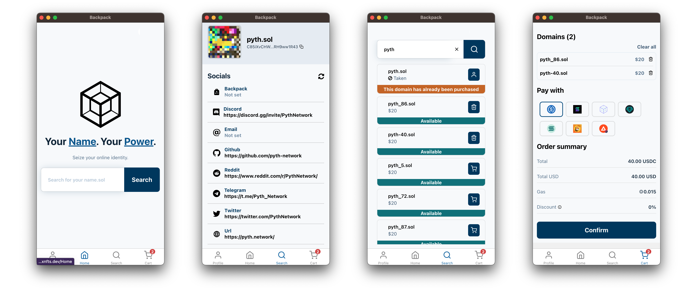

<h1 align="center">SNS Manager 🌐</h1>
 

 

Hello, Solana lovers! Welcome to the official repository for SNS Manager, your all-in-one tool for handling Solana Name Service (SNS) domains. With SNS Manager, you can view, manage, search, and register decentralized domain names that end with .sol right from your mobile device! How cool is that? 😎

 

 

 
<h2 align="center">Table of contents 📝</h2>
 

- [About SNS Manager](#about-sns-manager)
- [Features](#features)
- [Contribution](#contribution)
- [License](#license)

 
<h2 align="center">About SNS Manager 🚀</h2>
 

This open-source mobile app is designed to provide a seamless and user-friendly way to interact with Solana Name Service (SNS). If you're a fan of the decentralized web and love Solana, SNS Manager is the tool you need.

 
<h2 align="center">Features 🛠️</h2>
 

### Manage Your Domains 🎛️

Set your favorite .sol domain as default and manage your domain name records with ease. You can define your website or alternative addresses on other chains, or even set up your social records like Telegram, Reddit, and Discord. We've got you covered!

### View Your Domains 👀

See all the domains you own and transfer them as needed. Keep track of your digital assets in the decentralized web.

### Search Domains 🔍

Discover new domains, see their records, and learn more about their owners. Maybe you'll find your next big investment!

## Contribution 🤝

We love our community and we embrace contributions. If you're an open-source enthusiast, a Solana aficionado, or someone who loves building cool stuff, come join us! Check out our [contribution guidelines](CONTRIBUTING.md) and become a part of the SNS Manager journey.

## Rodmap 🗺️

| Feature             | Description                                                       | In progress | Completed | Bounty |
| ------------------- | ----------------------------------------------------------------- | ----------- | --------- | ------ |
| Subdomain support   | Add support for subdomain management, creation and search         | ❌          | ❌        | ✅     |
| Profile pic upload  | Allow people to upload a picture from device as a profile picture | ❌          | ❌        | ✅     |
| Wrap domain names   | Allow tokenization of domain names into NFT                       | ❌          | ❌        | ❌     |
| Chinese translation | Translate the app in Chinese                                      | ❌          | ❌        | ✅     |
| Korean translation  | Translate the app in Korean                                       | ❌          | ❌        | ✅     |
| Turkish translation | Translate the app in Turkish                                      | ❌          | ❌        | ✅     |

## License 📄

SNS Manager is an open-source project licensed under MIT. Feel free to explore, expand, and improve!

 
<h2 align="center">Wrapping Up 🎁</h2>
 

SNS Manager is more than just an app, it's a step towards a more decentralized future. Join us in this exciting journey. We can't wait to see what we'll build together! 🚀🌐

_If you have any questions or suggestions, feel free to open an issue or pull request, or simply contact us at [@bonfida](https://twitter.com/bonfida). We're always here for a good chat about Solana and the decentralized web!_
