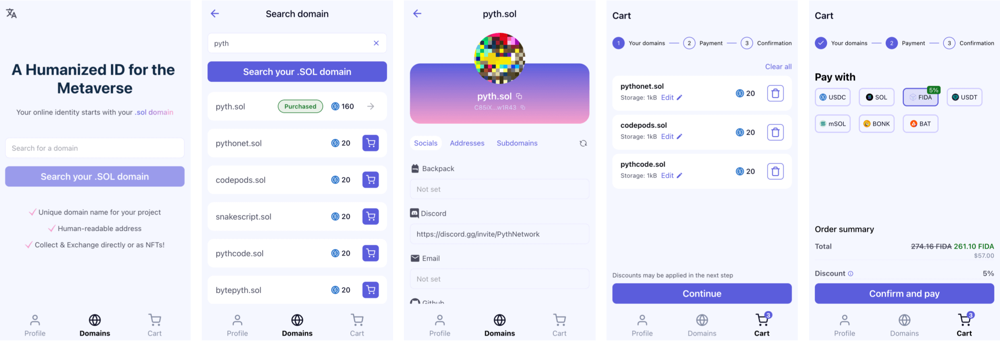

<h1 align="center">SNS Manager 🌐</h1>

 

 

Hello, Solana lovers! Welcome to the official repository for SNS Manager, your all-in-one tool for handling Solana Name Service (SNS) domains. With SNS Manager, you can view, manage, search, and register decentralized domain names that end with .sol right from your mobile device! How cool is that? 😎

 

 

<!-- ALL-CONTRIBUTORS-BADGE:START - Do not remove or modify this section -->

<!-- ALL-CONTRIBUTORS-BADGE:END -->

 
<h2 align="center">Table of contents 📝</h2>
 

- [About SNS Manager](#about-sns-manager)
- [Features](#features)
- [Contribution](#contribution)
- [License](#license)

 
<h2 align="center">About SNS Manager 🚀</h2>
 

This open-source mobile app is designed to provide a seamless and user-friendly way to interact with Solana Name Service (SNS). If you're a fan of the decentralized web and love Solana, SNS Manager is the tool you need.

 
<h2 align="center">Rodmap 🗺️</h2>
 

| Feature             | Description                                                       | In progress | Completed | Bounty | Contributor                             |
| ------------------- | ----------------------------------------------------------------- | ----------- | --------- | ------ | --------------------------------------- |
| UI/UX Redesign      | New UI/UX design for the app                                      | ✅          | ❌        | ✅     |                                         |
| Profile pic upload  | Allow people to upload a picture from device as a profile picture | ✅          | ❌        | ✅     |                                         |
| Turkish translation | Translate the app in Turkish                                      | ❌          | ✅        | ✅     | [Eren](https://twitter.com/inside_eren_tr)  |
| Chinese translation | Translate the app in Chinese                                      | ❌          | ✅        | ✅     | [2Tako2](https://github.com/2Tako2)     |
| Korean translation  | Translate the app in Korean                                       | ❌          | ✅        | ✅     | [mjLabrys](https://github.com/mjLabrys) |
| Wrap domain names   | Allow tokenization of domain names into NFT                       | ❌          | ✅        | ❌     | [W](https://github.com/wosleyv)         |
| Subdomain support   | Add support for subdomain management, creation and search         | ❌          | ✅        | ✅     | [W](https://github.com/wosleyv)         |

 
<h2 align="center">Development and Build Commands 💻</h2>
 

This section introduces commands to expedite the development and building processes of our React Native project for web and xNFT platforms, enhancing the wallet connection experience.

### Development

For development, you can initiate the server with `yarn dev:xnft` for the xNFT target and `yarn dev:web` for the web target.

### Building

To transition to a production-ready build, use `yarn build:xnft` for the xNFT target and `yarn build:web` for the web target.

### Wallet Connection

Both development and build configurations accommodate seamless wallet connection for web and xNFT platforms. Thus, these commands facilitate a unified and efficient experience of developing and building applications for different targets. Please report issues or suggestions through an issue or a pull request.

 
<h2 align="center">Features 🛠️</h2>
 

### Manage Your Domains 🎛️

Set your favorite .sol domain as default and manage your domain name records with ease. You can define your website or alternative addresses on other chains, or even set up your social records like Telegram, Reddit, and Discord. We've got you covered!

### View Your Domains 👀

See all the domains you own and transfer them as needed. Keep track of your digital assets in the decentralized web.

### Search Domains 🔍

Discover new domains, see their records, and learn more about their owners. Maybe you'll find your next big investment!

 
<h2 align="center">Contribution 🤝</h2>
 

We love our community and we embrace contributions. If you're an open-source enthusiast, a Solana aficionado, or someone who loves building cool stuff, come join us! Check out our [contribution guidelines](CONTRIBUTING.md) and become a part of the SNS Manager journey.

 
<h3 align="center">The Hall of Fame ❤️</h2>
 

Big thanks to our dedicated contributors, we are thrilled to recognize their contributions:

<!-- ALL-CONTRIBUTORS-LIST:START - Do not remove or modify this section -->
<!-- prettier-ignore-start -->
<!-- markdownlint-disable -->
<table>
  <tbody>
    <tr>
      <td align="center" valign="top" width="14.28%"><a href="https://mj-portfolio-ipfs.vercel.app/"> <b>MJ Lee</b></a> <a href="https://github.com/Bonfida/sns-manager/commits?author=mjLabrys" title="Code">💻</a></td>
      <td align="center" valign="top" width="14.28%"><a href="https://github.com/2Tako2"> <b>Felix</b></a> <a href="https://github.com/Bonfida/sns-manager/commits?author=2Tako2" title="Code">💻</a></td>
      <td align="center" valign="top" width="14.28%"><a href="https://github.com/wosleyv"> <b>W</b></a> <a href="https://github.com/Bonfida/sns-manager/commits?author=wosleyv" title="Code">💻</a></td>
      <td align="center" valign="top" width="14.28%"><a href="https://www.linkedin.com/in/sanjaysargam/"> <b>Sanjay Sargam</b></a> <a href="https://github.com/Bonfida/sns-manager/commits?author=SanjaySargam" title="Code">💻</a></td>
      <td align="center" valign="top" width="14.28%"><a href="https://cy.my"> <b>CY Lim</b></a> <a href="https://github.com/Bonfida/sns-manager/commits?author=cylim" title="Code">💻</a></td>
    </tr>
  </tbody>
</table>

<!-- markdownlint-restore -->
<!-- prettier-ignore-end -->

<!-- ALL-CONTRIBUTORS-LIST:END -->

Interested in contributing? Check out our contribution guidelines and join us in propelling this project forward.

 
<h2 align="center">License 📄</h2>
 

SNS Manager is an open-source project licensed under MIT. Feel free to explore, expand, and improve!

 
<h2 align="center">Wrapping Up 🎁</h2>
 

SNS Manager is more than just an app, it's a step towards a more decentralized future. Join us in this exciting journey. We can't wait to see what we'll build together! 🚀🌐

_If you have any questions or suggestions, feel free to open an issue or pull request, or simply contact us at [@bonfida](https://twitter.com/bonfida). We're always here for a good chat about Solana and the decentralized web!_
